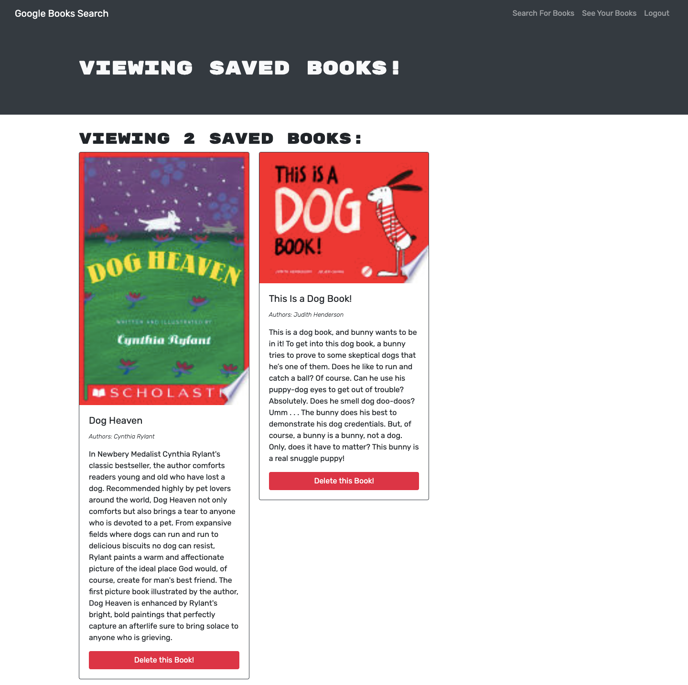

# Book Search Engine - MERN

## Description
This is a fully functioning Google Books API search engine built with a GraphQL API built with Apollo Server. It's set up to allow users to save book searches to the back end.

AS AN avid reader
I WANT to search for new books to read
SO THAT I can keep a list of books to purchase

## Built With
* React
* Node.js
* Express.js
* GraphQL API 
* MongoDB
* CSS
* JavaScript

## Deployed on Heroku
<https://ancient-thicket-51073.herokuapp.com/>

## Contribution
< > with ❤️  by Serena Guo

## Screenshots

